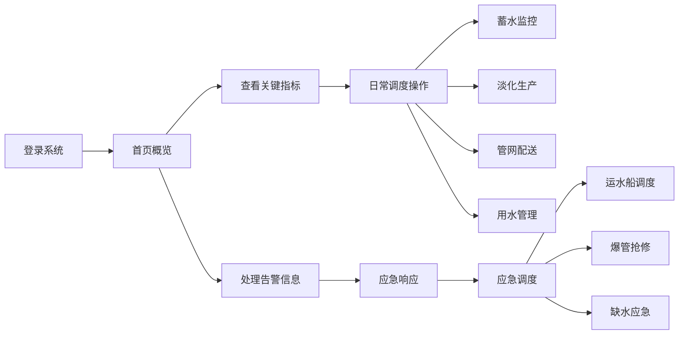

## 1. 产品概述

海岛淡水供应调度系统是一款面向海岛水务管理部门的专业客户端软件，用于统一管理海岛蓄水、海水淡化和配送全流程。系统整合水源台账、蓄水监控、淡化生产、管网配送、用水管理、设备维保、应急调度七大模块，实现海岛水资源的智能化、精细化管理。

- 目标用户：海岛水务管理部门、供水调度中心工作人员
- 核心价值：提升海岛水资源利用效率，保障供水安全，增强应急响应能力

## 2. 核心功能

### 2.1 用户角色

| 角色 | 注册方式 | 核心权限 |
|------|----------|----------|
| 调度管理员 | 系统分配 | 全部模块操作、应急调度指挥、数据统计分析 |
| 运维人员 | 系统分配 | 设备维保、管网巡检、水质检测 |
| 数据录入员 | 系统分配 | 水源台账维护、用水计量录入 |

### 2.2 功能模块

1. **水源台账**：水源信息管理、水库档案、海水淡化设施、雨水收集系统
2. **蓄水监控**：水库水位实时监控、蓄水量统计、雨水收集量监测
3. **淡化生产**：海水淡化产水监控、生产计划管理、能耗统计
4. **管网配送**：管网压力监控、流量监测、爆管预警
5. **用水管理**：居民用水计量、旅游旺季调度、用水统计分析
6. **设备维保**：设备档案管理、维保计划、维保记录
7. **应急调度**：缺水应急、运水船调度、爆管抢修、应急指挥

### 2.3 页面详情

| 页面名称 | 模块名称 | 功能描述 |
|----------|----------|----------|
| 首页概览 | 数据看板 | 关键指标展示、告警信息、快捷入口 |
| 水源台账 | 水源管理 | 水源列表、详情查看、新增编辑 |
| 蓄水监控 | 水位监测 | 实时水位曲线、蓄水量统计、水库分布 |
| 淡化生产 | 产水监控 | 产水量曲线、设备运行状态、能耗分析 |
| 管网配送 | 压力监控 | 管网压力热力图、流量监测、爆管预警 |
| 用水管理 | 用水统计 | 居民用水计量、旅游用水分析、用水趋势 |
| 设备维保 | 维保管理 | 设备列表、维保计划、维保记录 |
| 应急调度 | 应急指挥 | 应急事件列表、运水船调度、抢修派单 |

## 3. 核心流程

### 3.1 日常调度流程
管理员登录系统后，首先查看首页概览的关键指标和告警信息。根据蓄水情况和用水预测，调整海水淡化生产计划。监控管网压力和流量，及时发现异常。定期进行设备维保，确保系统稳定运行。

### 3.2 应急响应流程
当发生缺水或爆管等应急事件时，系统自动触发预警。调度员进入应急调度模块，根据事件类型启动相应应急预案。缺水时调度运水船补给，爆管时派遣抢修队伍。事件处理完成后，记录处理结果并归档。

## 4. 用户界面设计

### 4.1 设计风格
- **主色调**：深海蓝色 (#0C4A6E)，象征水资源和专业性
- **辅助色**：天蓝色 (#0EA5E9)、青绿色 (#06B6D4)，代表清新和科技感
- **警示色**：琥珀色 (#F59E0B) 预警、红色 (#EF4444) 告警、绿色 (#10B981) 正常
- **中性色**：深灰/深蓝灰色系，营造专业沉稳的氛围
- **整体风格**：工业科技风，深色主题为主，数据可视化突出，大屏监控感

### 4.2 设计元素
- 按钮风格：圆角矩形，微渐变，悬停有光效
- 字体：现代无衬线字体，数字使用等宽字体增强数据感
- 布局：侧边导航 + 顶部状态栏 + 主内容区，卡片式布局
- 图标：线性图标，统一风格，数据面板使用仪表盘样式
- 动效：数据加载有渐变动画，告警有脉冲闪烁效果

### 4.3 页面设计概览

| 页面名称 | 模块名称 | UI元素 |
|----------|----------|--------|
| 首页概览 | 数据看板 | 顶部状态栏、指标卡片、告警列表、快捷入口、趋势图表 |
| 蓄水监控 | 水位监测 | 水库列表、实时水位曲线图、蓄水量仪表盘、雨水收集统计 |
| 淡化生产 | 产水监控 | 设备运行状态、产水量趋势图、能耗统计、生产计划表 |
| 管网配送 | 压力监控 | 管网示意图、压力热力图、流量监测点、爆管预警列表 |
| 用水管理 | 用水统计 | 居民用水量柱状图、旅游用水对比、用水趋势分析 |
| 设备维保 | 维保管理 | 设备卡片网格、维保日历、维保记录列表 |
| 应急调度 | 应急指挥 | 应急事件时间线、运水船状态、抢修进度、应急预案 |

### 4.4 响应式
- 设计优先级：桌面端优先（大屏监控为主）
- 适配平板横屏，保证主要数据可见
- 侧边栏在小屏幕可收起

### 4.5 数据可视化
- 使用ECharts图表库展示各类监控数据
- 水位、压力等实时数据使用动态仪表盘
- 管网分布使用示意图或地图展示
- 告警信息使用醒目的颜色和动效突出显示
