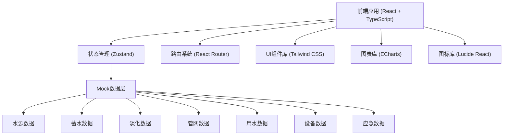
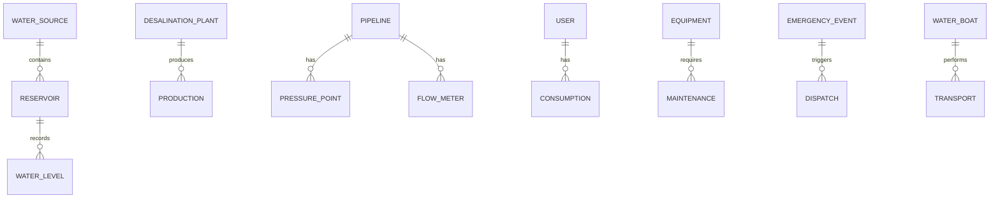

## 1. 架构设计



## 2. 技术描述

- **前端框架**：React 18 + TypeScript
- **构建工具**：Vite
- **样式方案**：Tailwind CSS 3
- **状态管理**：Zustand
- **路由管理**：React Router DOM
- **图表库**：ECharts (echarts-for-react)
- **图标库**：Lucide React
- **后端**：无后端，使用 Mock 数据
- **数据**：前端模拟数据，支持实时更新效果

## 3. 路由定义

| 路由路径 | 页面名称 | 模块名称 |
|----------|----------|----------|
| /dashboard | 首页概览 | 数据看板 |
| /water-sources | 水源台账 | 水源管理 |
| /storage | 蓄水监控 | 水位监测 |
| /desalination | 淡化生产 | 产水监控 |
| /pipeline | 管网配送 | 压力监控 |
| /consumption | 用水管理 | 用水统计 |
| /maintenance | 设备维保 | 维保管理 |
| /emergency | 应急调度 | 应急指挥 |

## 4. 数据模型

### 4.1 数据实体关系



### 4.2 核心数据类型

```typescript
// 水源类型
interface WaterSource {
  id: string;
  name: string;
  type: 'reservoir' | 'desalination' | 'rainwater' | 'groundwater';
  capacity: number;
  currentVolume: number;
  location: string;
  status: 'normal' | 'warning' | 'alarm';
  description: string;
}

// 水库水位记录
interface WaterLevelRecord {
  id: string;
  reservoirId: string;
  timestamp: Date;
  waterLevel: number;
  volume: number;
  inflowRate: number;
  outflowRate: number;
}

// 海水淡化厂
interface DesalinationPlant {
  id: string;
  name: string;
  capacity: number;
  currentOutput: number;
  operatingHours: number;
  energyConsumption: number;
  status: 'running' | 'standby' | 'maintenance' | 'fault';
  efficiency: number;
}

// 管网监测点
interface PressurePoint {
  id: string;
  name: string;
  location: { x: number; y: number };
  pressure: number;
  normalRange: [number, number];
  status: 'normal' | 'low' | 'high';
  lastUpdate: Date;
}

// 用水记录
interface ConsumptionRecord {
  id: string;
  date: Date;
  residential: number;
  commercial: number;
  tourism: number;
  industrial: number;
  total: number;
}

// 设备信息
interface Equipment {
  id: string;
  name: string;
  type: string;
  location: string;
  installDate: Date;
  lastMaintenance: Date;
  nextMaintenance: Date;
  status: 'normal' | 'due' | 'overdue';
  runHours: number;
}

// 应急事件
interface EmergencyEvent {
  id: string;
  type: 'water_shortage' | 'pipe_break' | 'equipment_failure' | 'water_quality';
  level: 'minor' | 'major' | 'critical';
  description: string;
  location: string;
  startTime: Date;
  endTime?: Date;
  status: 'pending' | 'processing' | 'resolved';
  handler?: string;
}

// 运水船
interface WaterBoat {
  id: string;
  name: string;
  capacity: number;
  currentLoad: number;
  status: 'docked' | 'sailing' | 'loading' | 'unloading';
  currentLocation: string;
  destination?: string;
  eta?: Date;
}
```

## 5. 项目结构

```
src/
├── components/          # 通用组件
│   ├── Layout/         # 布局组件
│   ├── charts/         # 图表组件
│   ├── cards/          # 卡片组件
│   └── common/         # 通用UI组件
├── pages/              # 页面组件
│   ├── Dashboard/      # 首页概览
│   ├── WaterSources/   # 水源台账
│   ├── Storage/        # 蓄水监控
│   ├── Desalination/   # 淡化生产
│   ├── Pipeline/       # 管网配送
│   ├── Consumption/    # 用水管理
│   ├── Maintenance/    # 设备维保
│   └── Emergency/      # 应急调度
├── store/              # 状态管理
│   └── index.ts
├── data/               # Mock数据
│   └── mockData.ts
├── types/              # 类型定义
│   └── index.ts
├── utils/              # 工具函数
│   └── format.ts
├── App.tsx
├── main.tsx
└── index.css
```

## 6. 组件设计原则

1. **单一职责**：每个组件只负责一个功能
2. **可复用性**：通用组件抽离到 components 目录
3. **类型安全**：所有组件使用 TypeScript 类型定义
4. **响应式**：组件适配不同屏幕尺寸
5. **性能优化**：合理使用 memo、useMemo、useCallback
